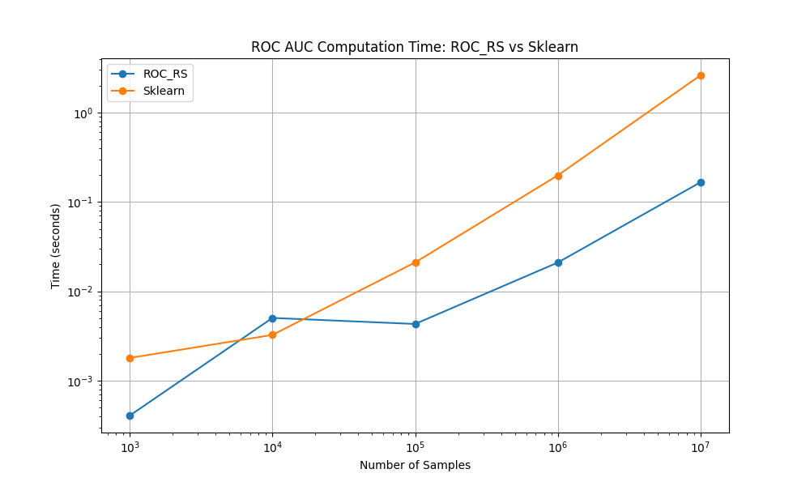
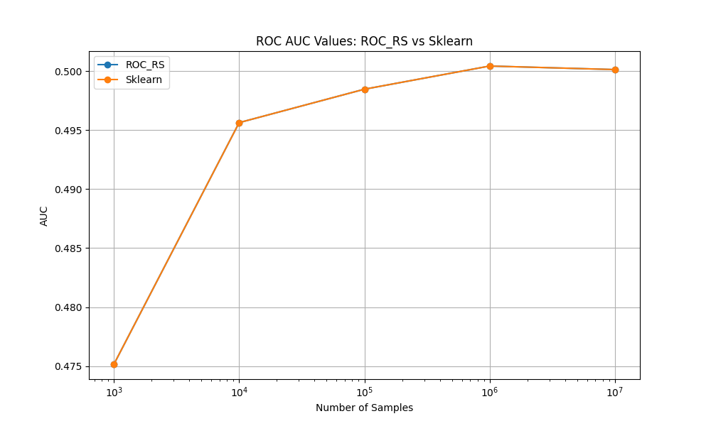

# roc_rs

[](https://github.com/yourusername/roc_rs/actions/workflows/ci.yml)

`roc_rs` is a fast Receiver Operating Characteristic (ROC) metrics calculator implemented in Rust with Python bindings.
It provides efficient computation of ROC curves and Area Under the Curve (AUC) for binary classification problems.

## Features
- Fast ROC curve computation
- AUC calculation
- Rust implementation with Python bindings for optimal performance
- Easy-to-use Python API

## Installation

To install `roc_rs`, follow these steps:

1. Clone the repo:

```
git clone https://github.com/allenwang28/roc.rs.git

cd roc.rs
```

2. Install the package:

```
pip install -e .
```


## Usage

Here's a simple example of how to use `roc_rs`:

```
import numpy as np
from roc_rs import PyRocMetrics

# Example data
scores = np.array([0.9, 0.8, 0.7, 0.6, 0.5], dtype=np.float32)
targets = np.array([1, 1, 0, 1, 0], dtype=np.int32)

# Create PyRocMetrics instance
roc_metrics = PyRocMetrics(scores, targets)

# Compute ROC
roc_data = roc_metrics.binary_roc()
print(f"True Positives: {roc_data.tps}")
print(f"False Positives: {roc_data.fps}")

# Compute AUC
auc = roc_metrics.compute_roc_auc()
print(f"AUC: {auc}")
```

## Performance

`roc_rs` is designed for high performance, especially with large datasets. Here's a comparison with scikit-learn's ROC AUC implementation:

| Sample Size | roc_rs Time (s) | sklearn Time (s) | Speedup |
|-------------|-----------------|------------------|---------|
| 1,000       | 0.000407        | 0.001797         | 4.4x    |
| 10,000      | 0.005039        | 0.003253         | 0.6x    |
| 100,000     | 0.004313        | 0.021048         | 4.9x    |
| 1,000,000   | 0.020999        | 0.198404         | 9.4x    |
| 10,000,000  | 0.166080        | 2.613099         | 15.7x   |

As you can see, `roc_rs` outperforms scikit-learn significantly for larger datasets, with up to 15.7x speedup for 10 million samples.

Visualizations:




These results can be reproduced via [examples/benchmark.py](examples/benchmark.py).


## Development
To setup the development environment:
1. Ensure you have Rust and Python installed on your system.
2. Install the required Python packages:
```
pip install -r requirements-dev.txt
```
3. Build the Rust extension:
```
maturin develop
```

## License
This project is licensed under the MIT license - see the LICENSE file for details.


## Continuous Integration

This project uses GitHub Actions for continuous integration. The CI pipeline:

- Runs on Ubuntu, Windows, and macOS
- Tests against Python versions 3.7, 3.8, 3.9, and 3.10
- Runs Rust tests
- Runs Python tests
- Executes the benchmark script

You can see the detailed CI configuration in `.github/workflows/ci.yml`.